<div align="center">

<picture>
  <source media="(prefers-color-scheme: dark)" srcset="brand/repo-banner-dark.svg">
  
</picture>

[](https://lazyscale.vercel.app)
[](https://lazyscale.vercel.app/automations)
[](#repository-map)
[](LOCAL.md)

[**Live site**](https://lazyscale.vercel.app) · [What we automate](https://lazyscale.vercel.app/automations) · [The short version](https://lazyscale.vercel.app/details)

</div>

---

## What this is

An automation service for Indian small businesses, sold as **AI employees**
rather than software. Each one gets a written job description, a probation
period and a monthly performance review — which sounds like a bit, but it turns
out to be the clearest way to say what a thing will and won't do before anyone
pays for it.

This repository is all of it: the site, the endpoints that do the actual work,
the importable workflow templates, and the operating documents that decide what
gets built and what gets politely declined.

No framework, no build step, no `node_modules` older than the business. Static
HTML with design tokens, and serverless functions on Vercel.

## The idea underneath it

Most businesses here don't lose customers to a competitor with better prices.
They lose them because someone was asleep, or on a call, or the message landed
on WhatsApp while everyone was watching email. The enquiry was fine. The timing
wasn't.

So this isn't "AI for your business". It's **response time**, and everything in
here points at that one number. If a feature doesn't move it, it doesn't ship.

---

## Install

Three things, none of them a database: **Node 18 or newer**, **Git**, and the
**Vercel CLI**. Python is only needed if you want to regenerate the artwork in
`brand/`, and you almost certainly don't.

### macOS

```bash
brew install node git            # or grab the installer from nodejs.org
npm install -g vercel

git clone https://github.com/divyanshus2404/lazyscale.git
cd lazyscale
./run-local.sh                   # http://localhost:3100
```

### Windows

```powershell
winget install OpenJS.NodeJS.LTS Git.Git
npm install -g vercel

git clone https://github.com/divyanshus2404/lazyscale.git
cd lazyscale
powershell -ExecutionPolicy Bypass -File .\run-local.ps1
```

`run-local.ps1` is the PowerShell twin of `run-local.sh` — it exists because
`vercel dev` resolves environment from the linked Vercel project rather than
from `.env.local`, on every platform, and both scripts work around the same
thing. If you'd rather not run a script you haven't read, **Git Bash** ships
with Git for Windows and runs `./run-local.sh` unchanged; so does WSL.

Developed on macOS with Node 20 and Vercel CLI 54; `run-local.ps1` mirrors the
tested bash script line for line but has not itself been run on Windows yet, so
if it argues with you, Git Bash is the path that is known to work. The endpoints themselves
contain nothing platform-specific — no path juggling, no shelling out — so the
only file that cares which OS you are on is the launcher.

---

## Run it in a minute

Already installed? Then: no keys, no accounts, no Vercel project, no sign-up
page asking for your work email.

<picture>
  <source media="(prefers-color-scheme: dark)" srcset="brand/terminal-dark.svg">
  
</picture>

Send it an enquiry the way a client's website form would:

```bash
curl -s -X POST "http://localhost:3100/api/inbound?k=demo" \
  -H 'Content-Type: application/json' \
  -d '{"name":"Priya","email":"priya@example.com",
       "message":"Do you deliver to Indiranagar? Need 30 chairs by Friday."}'
```

```json
{"ok":true,"replied":false,"recorded":true}
```

`recorded: true` is the part that matters — the enquiry is on disk before
anything else is attempted. `replied: false` because there is no mail server on
your laptop; the record survives that, which is the whole design.

Then read it back the way a monthly review does:

```bash
curl -s "http://localhost:3100/api/stats?k=demo&s=local-dev-secret&days=30"
```

```json
{"ok":true,"truncated":false,"partialRead":false,"tenant":"demo",
 "windowDays":30,"since":"2026-08-15T17:24:46.888Z","enquiries":1,
 "scored":0,"medianScore":null,"escalated":0,"handledWithoutAHuman":100,
 "alertsFailed":1,"topEscalationReasons":[],"byDay":{"2026-09-14":1}}
```

`alertsFailed` counts honestly rather than hiding the missing mail server.
Full walkthrough, including the drop-in and inbound email: [`LOCAL.md`](LOCAL.md).

---

## The console

`/app` is where the enquiries actually get read: search, a 7/30/90/365-day
window, a "needs a human" filter, and each enquiry expandable to the full
message, the draft reply and why it escalated.

It runs on the same tokens as the site, follows your system theme with a manual
override, and works down to a phone. Open it locally at
<http://localhost:3100/app> with the tenant key and `ADMIN_SECRET`.

On a Mac you can skip the terminal entirely: double-click
**`mac/LazyScale Console.command`**, or build a proper app with
`./mac/make-app.sh`. Both are covered in [`mac/README.md`](mac/README.md),
including the one macOS permission the app bundle needs when the project lives
in `~/Downloads`.

Both credentials live in `sessionStorage` and never go in the URL, where they
would end up in browser history and server logs. Closing the tab forgets them;
signing out clears the screen as well as the memory.

---

## Repository map

```
index.html              the site — one file, design tokens, no build step
automations.html        55 automations, filterable, including what we refuse
details.html            the one-screen version, for pasting into a chat
response-times.html     publishes the response-time experiment (see research/)
setup.html              per-client onboarding page, keyed by ?k=
app.html                the console — read the enquiries, one screen
run-local.sh            one command to run it all — macOS, Linux, Git Bash, WSL
run-local.ps1           the same, for PowerShell
mac/                    double-click launchers for the console

api/
  lead.js               the Lead Responder: scores, drafts, escalates
  inbound.js            the drop-in — tenant-aware form endpoint, no credentials
  email-in.js           inbound email, provider-agnostic
  _forwarded.js         recovers the original sender from a forwarded enquiry
  audit.js              generates the free automation audit
  stats.js              the monthly performance-review numbers
  _store.js             durable record: Supabase, or a local file when offline

services/               what we sell, how it is delivered, what we refuse
  ai-employees/         a job description per role, sent before any build
  workflows/            importable n8n templates

research/               the response-time experiment: method and log
brand/                  the link-preview card and how to regenerate it
```

---

## The endpoints

<picture>
  <source media="(prefers-color-scheme: dark)" srcset="brand/pipeline-dark.svg">
  
</picture>

The lime step is the one that matters. Everything to the right of it can fail —
no key, no credit, model down, mail bouncing — and the enquiry is still yours.

| Endpoint | What it does |
|---|---|
| `POST /api/inbound?k=<key>` | The drop-in. A client points an existing form here; every enquiry is captured and pushed to them. **No credentials change hands.** Reads JSON or form-encoded, maps field names rather than demanding a schema. |
| `POST /api/email-in?k=<key>&s=<secret>` | Inbound email. Normalises Postmark, SendGrid, Mailgun, CloudMailin and Cloudflare Email Worker payloads, then hands off to the same pipeline. |
| `POST /api/lead` | The Lead Responder running on our own inbound. Scores 0–10, drafts a reply, escalates when it should not answer. |
| `POST /api/audit` | Generates a personalised automation audit from a form submission. |
| `GET /api/enquiries?k=&s=&days=&limit=` | The enquiries themselves, newest first — what the console reads. Same refusal as `/api/stats`: no `ADMIN_SECRET` set means no access, never open access, because this returns customers' names and messages. |
| `GET /api/stats?k=&s=&days=` | The numbers behind a client's monthly performance review. Refuses every request unless `ADMIN_SECRET` is set and matches. |

### Two design decisions worth knowing

**Capture before spend.** Every endpoint records the enquiry before it calls a
model. A failure further down never costs the lead.

**Degrade toward working.** Without `ANTHROPIC_API_KEY` the drop-in still
captures the enquiry and alerts the owner within seconds — which is most of the
value. The key adds scoring and drafting; it is not load-bearing for delivery.

### The forwarded-email problem

<picture>
  <source media="(prefers-color-scheme: dark)" srcset="brand/forwarded-dark.svg">
  
</picture>

When a business forwards a customer's enquiry, the envelope sender is *the
business*. The customer is named inside the forward header the mail client
inserted. Trusting the envelope puts the client's own address in `reply-to`, so
every reply goes back to them instead of out to their customer — silently, every
time.

[`api/_forwarded.js`](api/_forwarded.js) recovers the real sender from Gmail,
Outlook, Apple Mail and Thunderbird formats plus several localised ones, strips
the forward preamble and the quoted thread, and **returns null rather than
guessing** when the block is unparseable, so the caller falls back to the
envelope.

---

## Environment

Set in Vercel → Settings → Environment Variables. **Redeploy after changing any
of them** — env vars only apply to new deployments.

| Variable | Required for | Notes |
|---|---|---|
| `ANTHROPIC_API_KEY` | scoring, drafting, audits | **Set a monthly spend cap before anything else.** A public endpoint on a paid model is exactly what gets abused, and the cap is the only thing that bounds the damage. |
| `RESEND_API_KEY` | sending any email | Free to 3,000/month |
| `OWNER_EMAIL` | where alerts go | |
| `TENANTS_JSON` | the drop-in | `{"<key>":{"name","email","autoreply":false,"threshold":11}}`. Kept in an env var rather than a repo file so client addresses stay out of git history. |
| `EMAIL_IN_SECRET` | inbound email | `openssl rand -hex 24` |
| `LEAD_AUTOREPLY_THRESHOLD` | auto-reply | Defaults to **11 on a 0–10 scale — i.e. never**. Nothing auto-sends until it has earned it. |
| `SUPABASE_URL`, `SUPABASE_SERVICE_ROLE_KEY` | recording every enquiry | Without these nothing is written down, and the monthly performance review every job description promises cannot be produced. See [`services/RECORDING.md`](services/RECORDING.md). **Service role key bypasses all security rules — server only.** |
| `ADMIN_SECRET` | `/api/stats` | No secret set means the endpoint refuses everything, rather than defaulting to public |
| `FORMSPREE_ENDPOINT` | form capture | Optional |
| `LEAD_REPLY_FROM`, `AUDIT_FROM_EMAIL` | sending identity | Optional |

Auto-reply is off by default and stays off deliberately. Four guards must all
pass before anything reaches a customer: a usable draft, no escalation flag, a
valid address, and a score at or above a threshold someone chose on purpose.

---

## Regenerating the brand assets

The banner at the top of this file, the link-preview card, and the logo files
are all rendered from HTML that uses the site's tokens — because an image you
redraw by hand is an image that goes stale. The previous preview card sat
unchanged through a full rebrand, so for weeks every link shared showed a
company that no longer existed.

### The link-preview card

```bash
"/Applications/Google Chrome.app/Contents/MacOS/Google Chrome" \
  --headless --disable-gpu --force-device-scale-factor=2 \
  --window-size=1200,630 --virtual-time-budget=6000 \
  --screenshot=og-image.png brand/og-image.html
```

Every asset and its exact command is in [`brand/README.md`](brand/README.md),
including the README banner's two theme variants.

---

## Design notes

**Tokens do the work.** Colour, spacing, radius and type are custom properties
on `:root`, with a dark variant. Restyling the whole site is a token change, not
a rewrite — which is how it went from a neo-vintage look to this one in an
afternoon, with no find-and-replace archaeology afterwards.

**Lime is a fill, not a text colour.** `#B7F34A` is 1.23:1 on the off-white
background, so in light mode it colours buttons, ticks and rules while near-black
carries every word. On the dark background it clears AA at 14.9:1 and becomes
text. That is why sites built on this palette tend to be black.

**Motion is an enhancement, never a gate.** Every reveal is scoped to a class
that JavaScript adds, with a failsafe that shows everything if the observer never
fires. With scripting off the page renders complete — long, but complete.
Anything that hides content until an animation runs has been treated as a bug in
this repository, several times.

**Verified, not assumed.** Contrast, heading order, overflow and control sizing
get measured in both themes, at mobile and desktop, before anything ships. And
then someone looks at the page anyway — because the best bugs in here sailed
through every automated check and were caught by a human going "hang on, why is
the lock icon enormous".

---

## Contributing

Setup, the branch workflow, and five rules that have each earned their place by
causing a real bug are in [`CONTRIBUTING.md`](CONTRIBUTING.md).

After any visual change, paste [`check.js`](check.js) into the browser console.
It reports contrast failures, heading-order jumps, controls narrower than their
own label, stray markup and sideways overflow — in both themes, in about a
second. It is cheerfully blunt and usually right.

## Licence

None granted — the code and the operating documents belong to LazyScale. You're
very welcome to read it, learn from it, and tell me what I got wrong.
